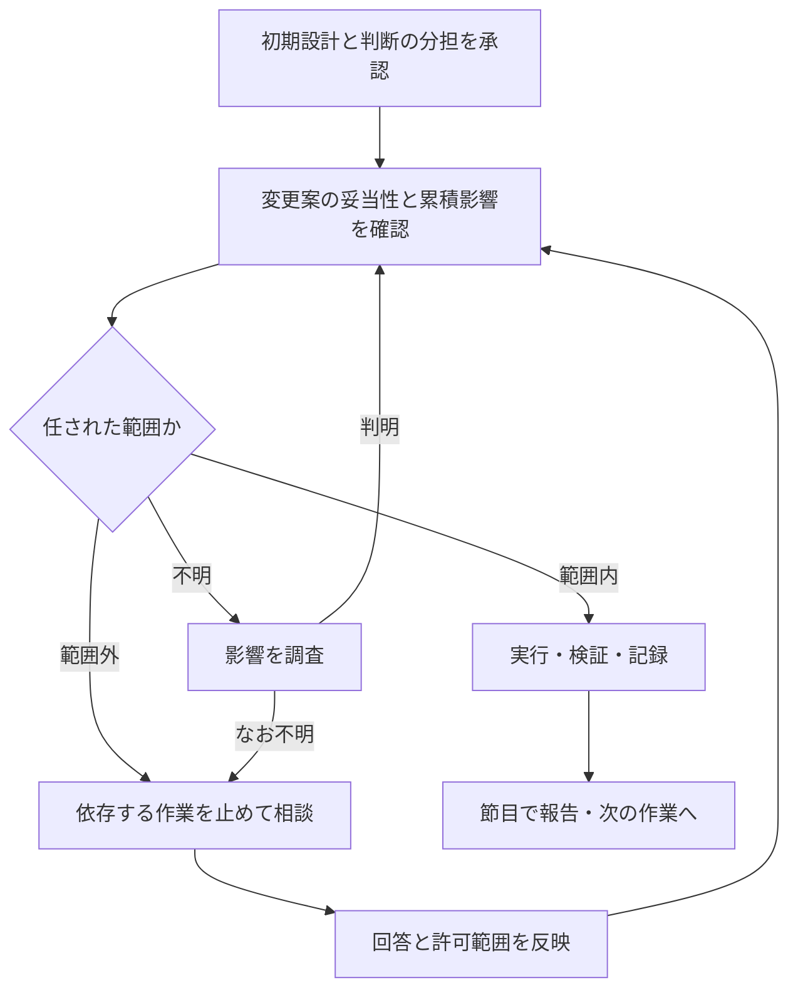

# 判断の分担に基づく自動進行

本仕様はIssue-0122の承認済み全体方針を具体化した実装仕様である。本仕様を読んだこと自体は実行許可にならず、作業ごとの判断の分担の合意を要する。

## 読み方と構成

| ファイル | 責務 |
|---|---|
| [01-agreement.md](01-agreement.md) | 初期設計で判断の分担を合意し、適用範囲を識別する |
| [02-application.md](02-application.md) | 計画・レビュー・実装・ADRで判断権限を適用する |
| [03-continuation.md](03-continuation.md) | 判断の根拠を記録し、再開・撤回・終了で扱う |

主要な構成要素が3つあり、feature-block-designの適用しきい値に該当する。処理の入口と共通判定は01、各工程の接続は02、状態の保持は03が所有する。新しい独立スキルや許可台帳は設けない。

## 背景と目的

ユーザーが留保する判断を守りつつ、任せられた範囲では局所仕様の変更も含めてAIが進める。レビューの推奨が全件一致することや、初期仕様から変更がないことを自動進行の必要条件にしない。判断の妥当性と、その判断を誰が決められるかを分ける。

## 処理の流れ

1. AIが初期設計とともに、相談事項・委任範囲・限度を短く提示する。
2. ユーザーが設計と判断の分担を承認する。AIは対象作業と許可の根拠を記録する。
3. 後続工程で変更や選択が生じたら、既存の妥当性検査と01の権限判定を行う。
4. 範囲内なら実行・検証・記録し、節目に通知する。範囲外なら依存する作業を止めて相談する。不明なら調査し、なお不明なら相談する。
5. ユーザーの回答を関係工程で共有し、同じ判断の再承認を求めず再開する。
6. 再開時は許可の根拠と変更履歴を読み直す。対象作業完了・撤回・別作業への移行で適用を終了する。

## 接続と既存仕様

共通の判定規範は`skills/start-work/references/decision-delegation.md`へ置く。start-work本文は発火点を持つ。pre-finalization-review、decision-log、計画逸脱判断、subagent-dispatch、session-handoffから共通規範を参照し、判定条件を複写しない。

既存の`skills/start-work/references/plan-deviation-defaults.md`は型分類・妥当性・逸脱記録の正本を維持する。新しい共通規範は判断権限を担う。新規計画の確定時には委任された局所仕様変更を宣言欄の採用基準へ反映し、両者を照合する。具体手順は02を正とする。対象計画で既に固定された採用基準を委任の存在だけで変更せず、既存計画への事後適用はその計画の基準変更規定に従う。

外部プラグインのキャッシュを書き換えない。superpowersへの接続はstart-workの入口と実行時の引き継ぎから行う。上位指示・実行環境の権限・専用の操作承認が優先する場合はそれに従い、実際に自動進行できる範囲を説明する。ツール実行の確認設定を変えるだけでは、設計の影響を判断する本要件を実現できないため、設定変更を対策とはしない。

## 対象外

自動push・デプロイなど外部操作への包括許可、全プロジェクト共通の恒久許可、全仕様への重要度付け、独立した承認台帳、変更ごとの通知、新しいレビュー工程の増設は対象外。Issue-0130の公開確認の要否は別課題であり、本仕様で決着させない。

## 検証と完了基準

以下は設計を評価するシナリオの期待結果であり、実行済みの検証結果ではない。委任なしの従来経路と委任ありの経路を同じ開始点で比較する。過去実例はIssue-0110の計画実行中の設計判断、およびIssue-0107の推奨とユーザー判断が異なった場面を参照し、当時の許可が不明なら仮定を明示する。

| 場面 | 期待結果 |
|---|---|
| 初期設計に分担を提示していない | 通常の設計承認を包括委任と解釈しない |
| 分担を明示した設計を承認した | 対象作業に限って適用し、許可を再質問しない |
| 補助機能の方式変更が委任範囲内 | 仕様変更を伴っても採用・検証・記録して進む |
| 対策の縮小が相談対象の保護水準を変える | 機能名や修正量によらず相談する |
| 一部採用・一部不採用で全て範囲内 | 全件一致を要求せず進む |
| 計画・実装で全体設計の前提崩壊を発見 | 依存する作業を止め、影響と選択肢を提示する |
| 局所変更の累積で限度を越える | 最後にユーザー承認した基準から判断して相談する |
| 不明点を調査すると範囲内と判明 | 判断要求を増やさず進む |
| 不明点が解消しない | 不足情報を示し相談、独立作業は続ける |
| サブエージェントが範囲内と主張 | 委譲元が根拠と影響を確認し最終判定する |
| 委任ありだが既存計画の採用基準外 | 委任だけを理由に採用せず、既存基準の扱いに従う |
| 同じ作業の再開・根拠あり | 現在の許可・撤回の有無を復元して継続する |
| 許可根拠の喪失・別作業・撤回 | 許可を推測して拡張しない |
| ユーザーが設計変更に回答した後のADR | 同じ判断を再質問せず、必要な記録・検証は行う |
| pushを提案する段階 | 作業単位の委任を送信承認に流用しない |
| 初期合意で後続レビューも含む分担を承認し、方式は名指ししていない | 別個のレビュー許可を要求せず共通判定で方式を選ぶ |
| 費用・回数の限度指定がない | 指定不足を理由に停止せず既存の費用比較・停止判断を使う |
| 新規計画の既定採用基準が委任された局所変更を扱えない | 計画確定前に宣言欄へ反映し、実装中の再承認待ちを防ぐ |
| 同日に仕様を複数回更新して再開 | 現行文書を承認基準とせず、承認時点の根拠から累積影響を判定する |
| 委任でレビューを確定してstart-workへ復帰 | 個別回答を取り直さず、確定結果と委任根拠を既存記録へ残す |

仕様と実装の接続を確認し、生成物の同期・記法・参照先を検証する。実装計画には各シナリオの入力文脈・確認方法・期待結果を具体化する。文章に同じ条件を書いたことだけを動作検証とせず、境界を外す変更で期待結果が変わるかも確認する。全工程の実施完了、委任内変更の報告、未完了・相談待ちの明示が揃って対象作業を完了とする。

## 過剰適合点検（ADR-0079）

| 観点 | 判定 | 根拠 |
|---|---|---|
| 出所の偏り | 要是正→許可された作業への限定 | 待ち時間調査はLoopForAlphaの121セッション、詳細確認6本という単一プロジェクトの報告。要件の説明は本リポジトリの本会話1件。出所2プロジェクトで、自動進行の試行は0サイクル。調査対象のモデル世代別内訳は未確認で、実証済みの一般効果を主張しない |
| システム種別依存性 | 問題なし | 特定の製品や機能を一律に低影響としない。既存の計画逸脱規範の適用対象・採用基準、操作権限の条件を維持する |
| AIモデル/ツール依存性 | 要是正→能力と権限の確認 | 永続メモリ・任意の割り込み機構・共有会話を仮定せず、実在するファイルと承認時点を識別できる記録を用いる。gitがない場合は承認直後の境界の記録を既存文書へ置く。外部スキル・上位指示との競合をこの規範で上書きしない。subagent-dispatchの既存委譲条件を維持する。数値予算の合意は仮定せず、既存レビューの費用比較と停止条件を維持する |
| 規範の廃止条件 | 定義済み | ADR-0133の初回対象作業で既存記録から再確認・境界超過・整理負担を点検。再確認が減らない、または境界超過を見逃すなら縮小・簡素化・撤回を検討する |

## 関連する決定

- [ADR-0133](../../../records/decisions/0133-delegate-decisions-by-agreed-impact-boundaries.md): 合意した判断の分担と影響を自動進行の基準とする。
