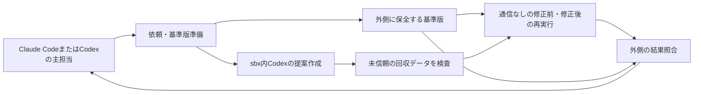

# Codexの提案と通信なし再実行によるLinux・Python検証

- 状態: schemaVersion=3の詳細仕様を確定。基本方針・4責務の承認後、静的フルレビュー1回・差分再確認2回で残指摘0件。確定記録はdocs/records/reviews/2026-09-09-proposal-replay-spec-r3.md。実装・動的実証は未完。
- 2026-09-10の確定した試作条件: ADR-0160/0161により、合成題材に限りVM資源割当・外側停止を基準とし、clipboard文字列書込を例外受容。条件改訂の差分再確認2回で残指摘0件。記録はdocs/records/reviews/2026-09-10-synthetic-pilot-scope-r2.md。動的実証は後続。
- 実装済み: v1部品に加え、v3の4責務・共通CLI・復旧操作（計画docs/working/plans/2026-09-14-isolated-verification-v3-implementation.md のタスク1〜9）。偽sbxによる独立試験11群。
- 実証済み（2026-09-18時点、sbx 0.42.1、synthetic-pilot）: replay/proposal両profileの能力証拠（タスク8a・8b・9）、CLI強制終了後の自動停止と記録済みIDだけの復旧、Codex主担当（2026-09-17）とClaude Code主担当（2026-09-18）からの候補比較→採用→recheckの往復（V7）。記録はdocs/records/experiments/2026-09-18-task9-claude-code-roundtrip.md ほか。
- 未実証・受容済みの制限: デーモン切断時の挙動（ADR-0196）、厳密なプロセス数上限、clipboard文字列書込（ADR-0161）、稼働中の他VMの非停止、敵対的な回収物の実機試験、任意プロジェクト・通常運用への適用。

## この文書の読み方

| ファイル | ブロック | 主な実装先 |
|---|---|---|
| 01-request-and-copy.md | 依頼・基準版準備 | RequestCopy.psm1、CLI、入力schema |
| 02-isolated-execution.md | Codexの提案作成・回収 | Proposal.psm1、SbxRuntime.psm1、提案schema |
| 03-result-collection.md | 結果照合・返却 | Result.psm1、結果schema |
| 04-offline-replay.md | 通信なし再実行 | Replay.psm1、再実行記録schema |

実装先はscripts/verification/配下。ファイル番号ではなく、準備→提案→再実行→照合の順に呼ぶ。既存の03ファイル名は維持する。

## 目的と範囲

主担当はClaude CodeまたはCodex。共通CLIが原本からファイル・Git履歴を複製し、sbx内の検証担当Codexが必要な資料を検索して再現テストと修正候補を提案する。親AIや利用者が資料本文を転記しない。子に渡すコピーは変更される前提とし、外側に保全した基準版から、別の通信なし環境で採否用のテストを取り直す。

初回は標準ライブラリだけで動く小さなLinux・Python題材、unittestによる再現テストを対象にする。依存の実行中取得、複数言語、ビルド基盤の自動選択は含めない。提案と再実行は順番に行い、同時稼働を必要としない。実プロジェクトへの修正適用は主担当の通常工程に残す。

現在解放する用途は、小さな合成題材によるsynthetic-pilotだけ。実行前に名指しで確認した合成入力に限定し、scopeの自己申告だけで任意のsourceRootを合成題材と認定しない。実プロジェクトや普段使いへの拡張は別判断とする。試作に成功しても自動的に通常運用へ移行しない。

recheckでは提案作成を省略する。準備時に前回の採用テストを検査して固定し、提案ブロックはモデル・VMを起動せず、再利用テストの受渡し結果だけを外側で生成する。4責務の通常経路と、既存テストを現在版へ実行する経路を区別する。

## 全体構成と信頼境界

| ブロック間呼出し | 返す型 |
|---|---|
| New-VerificationRun(RequestV3, SettingsV3) | PreparedRunV3 |
| Invoke-VerificationProposal(PreparedRunV3) | ProposalResultV3 |
| Invoke-VerificationReplay(PreparedRunV3, ProposalResultV3) | ReplayResultV3 |
| Complete-VerificationRun(PreparedRunV3, ProposalResultV3, ReplayResultV3) | VerificationResultV3 |

データはJSON化可能な値だけ。ハンドルや任意の実行コールバックを渡さない。CLIはInvoke-IsolatedVerification.ps1 -RequestPath ... -SettingsPath ...で、v3だけ受け付ける。既存v1部品の公開契約と試験は保持する。未実装v2は受理しない。v1/v2のイベントをv3の証拠に変換して成功扱いしない。

## 主要な流れ

1. 入力を検査し、runIdを発行、原本の選択版と独立Gitをbaselineへ固定する。
2. 外側のSbxRuntimeが版・テンプレート・起動条件・保護の成立を確認する。未確認なら子へ資料を解放せずblocked。
3. 子は独立コピーで提案を作る。子のログ・実行報告・Gitコピーを採否の証拠にしない。
4. 外側が容量上限付きのデータ列として提案を受け、パス・型・件数・内容を検査して通常ファイルだけ新規作成する。子VMの停止を確認して提案を固定する。
5. baseline＋同じ再現テストで修正前を、baseline＋修正候補＋同じ再現テストで修正後を、それぞれ別の新しい通信なしVMで実行する。修正後実行を先に作ったVMの再利用にしない。
6. 原本・baseline・テストのハッシュと外側記録を照合して返す。再実行が成立してもテストの意味・十分性は主担当が評価する。

途中失敗で後段を実行できない場合も、CLIはnot_runの型付き結果を作って照合へ渡す。未実行を成功や停止成功と記録しない。01の全体開始時刻・deadline・manifest期待hashを同じPreparedRunV3として全段へ渡し、段階ごとに制限時間をリセットしない。

準備後、CLIは02のAcquire-VerificationPilotLeaseでpilot共通の起動排他を取得する。通常提案とrecheckの両経路を覆い、全停止処理後のfinallyでRelease-VerificationPilotLeaseを呼ぶ。競合時はVMを作らずblocked。全体期限への到達でLeaseを取得できなかった場合に限り、Leaseを持たずに提案（VMを作らずtimed_out）→未実行の再実行結果→照合へ進む。Leaseを持たないVM作成は02が拒否するため、同時1VMの保護は緩めない（ADR-0198）。入力の試作限定性は01の固定入力記録と現物hashで照合し、scopeのラベルだけに依存しない。

CLIが強制終了などで停止確認まで進めなかった場合は、stderr先頭に出したrunRootを指定する復旧操作（-StopRecorded -RunRoot）で、control/runtimeに記録済みのVMのIDだけを停止・確認し、recovery-<時刻>.jsonへ残す。記録にないVMには触れない（ADR-0194）。

## 実行基盤の成立条件

ローカルsbxを候補実装先とする。提案用と再実行用は別の実行設定を持つ。同じ製品であっても保護条件を共用済みにしない（synthetic-pilotに限り、負荷中の外側停止の記録だけは再実行用の既存記録を提案用の証拠に使う。ADR-0197）。再実行側の通信・追加ホスト経路の拒否が実証できなければ、基盤変更を相談してblockedとする。

現PCは通常ターミナルで起動したデーモンを前提とする。CLIから自動修復・退避・再起動・ログイン・policy initをしない。デーモン停止時は利用者に通常起動が必要と返す。create/exec等の自動起動副作用を避けるため、直前に稼働確認し、途中停止時は後続の作成・execを中止する。競合時の再起動を防げる起動方法の実証も実行設定の成立条件に含める。

共有workspace・共有skills・追加MCP・ホストDocker・ホストホーム・原本・controlへの経路は与えない。SSH転送等、通常のファイル共有以外のホスト作用も起動前に拒否を実証する。clipboard文字列書込だけはsynthetic-pilotの明示した例外。画像読取無効を確認し、文字列書込の可能性を開始時と結果に表示する。例外以外の条件は単に未使用・設定項目不明で合格にしない。秘密値・OSの資格情報ストアの内容を記録や子の環境変数へコピーしない。

資源保護はvCPU2・ゲストメモリ2048MiB、当該ワークフローの同時稼働1VM、外側の時間・出力上限と停止確認を必須とする。厳密なプロセス数上限は保証しない。有限の負荷条件で停止を実証し、VM内資源枯渇や停止未確認を成功にしない。ホストの全オーバーヘッドまでゲスト割当内に収まるとは主張しない。

試作中・直後はclipboardの内容が変わりうるため、そのまま貼り付けず、必要な内容を信頼できる元から利用者がコピーし直す。実行処理がclipboardを読取・保存・復元・消去する機能は設けない。例外を安全な出力経路として利用しない。

## 保護の意味と限界

原本・基準Git・外側記録は子に渡さない。子の作業Git、試行ログ、提案文は未信頼。提案側にモデル通信を許しても、採否用再実行には認証・通信許可を渡さない。全試行の通信禁止・全内部操作の監査は要求しない。

再実行の出力も未信頼コードが生成する文字列。外側記録が証明するのは指定入力・指定コマンドの実行と観測結果であり、テストの正しさではない。終了0、fail→passだけで修正を自動適用しない。停止未確認なら成果物を採用可能にしない。

## 成功基準

| ID | 必須の実証 |
|---|---|
| V1 | ファイル・HEAD・headRef・全参照の独立コピーと途中変更検知。既存v1試験の維持 |
| V2 | 子から原本・baseline・control・資格情報・例外以外の追加ホスト経路へ到達できないこと。clipboard文字列書込の試作限定例外と画像読取無効を確認し、他の未確認は起動拒否 |
| V3 | 不正パス・リンク・重複・大容量・壊れた提案を、ホストへの範囲外書込や実行なしで拒否 |
| V4 | 同一テスト・別の新規VM・通信なしで修正前失敗/修正後成功を実行し外側で記録 |
| V5 | 出力超過・時間超過・CLI切断時の停止、対象外VMの継続、停止未確認時の失敗扱い |
| V6 | 原本更新・baseline改変・テスト改変・証拠欠落・版混在を成功にしない |
| V7 | Claude CodeとCodexの両主担当から検査→回収→主担当による修正→同一テスト再検証。手動本文転記なし |

## 判断の分担と参照

基本方針はADR-0157、4責務・補助設計の委任はADR-0158。ユーザーの「１で」は分割と補助設計を承認した回答。保護の追加緩和、新たな必須基盤・利用者作業、認証・利用費・送信範囲、削除・公開は相談する。詳細仕様は提示後に確定し、独立レビューの送信承認は別に扱う。

関連: ADR-0145〜0150、0157、0158。試作条件・実現手段はADR-0159〜0162、0192〜0201。実機根拠はdocs/records/experiments/2026-09-09-sbx-smoke.md と、タスク8・9の実験記録（2026-09-16〜18）。旧ホスト上Codex構成はADR-0152の過去記録と旧計画を参照し、現行実装指示にはしない。
