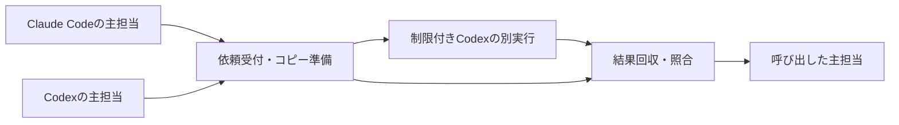

# Claude CodeとCodexから利用する隔離検証の共通起動処理

- 状態: 2026-09-09、ユーザーが採否案を含む仕様を確定。実装・実経路の検証前。
- 初回対象: Windows 11、PowerShell 7、Codex CLI 0.153.4。別の版は対応確認の対象とし、自動で確認済みにしない。

## この文書の読み方

| ファイル | 内容 |
|---|---|
| `01-request-and-copy.md` | 依頼受付・対象版の固定・コピー準備 |
| `02-isolated-execution.md` | 制限付きCodexの起動・終了管理 |
| `03-result-collection.md` | 結果回収・対象版と保護状態の照合 |

以下の対象ファイル・関数は新規実装の契約であり、現在利用できる機能ではない。

## 背景と目的

主担当は各プロジェクトのClaude CodeまたはCodexを維持する。検証時に共通CLIへ依頼し、別実行のCodexが検証用コピー内で追加テストを作成・実行する。結果を主担当へ戻し、本体修正と取り込みは主担当が扱う。利用者による依頼・結果の手動転記を通常手順に含めない。

## 全体構成

| ブロック | 責務 | 出力先と利用者 |
|---|---|---|
| 依頼受付・コピー準備 | 入力の検査と対象ファイルの複製 | `PreparedRun`を実行と回収へ渡す |
| 制限付き実行 | 指定した範囲だけへ書けるCodexを起動する | `ExecutionResult`と実行記録を回収へ渡す |
| 結果回収 | 実行結果・対象版・成果物を照合する | `VerificationResult`を主担当へ返す |

共通入口は `scripts/verification/Invoke-IsolatedVerification.ps1`。両主担当が、依頼ファイルと導入設定ファイルを引数で渡す。MCPサーバーや常駐サービスの登録を初回の必須条件にしない。起動権限が足りない環境では、その理由と必要な操作を返す。

## 主要な処理フロー

1. 依頼・導入設定・実行可能ファイル・入力と出力の位置関係を検査する。検証担当に渡す前に受付を完了する。
2. 一意の実行番号で新しい作業領域を作る。対象の未コミット変更と選択した未追跡ファイルを複製し、一覧とハッシュを保存する。
3. 読み取り専用の制御領域と、書き込み可能な検証用コピー・専用一時領域を区別して、Codexの別実行を起動する。
4. Codexが追加テストを作成・実行する。起動処理が標準出力・標準エラーを保存し、終了状態を取得する。
5. 回収処理が対象版、原本状態、生成物、最終応答を照合する。古い対象版の結果を現在の原本への合格にしない。
6. 最終JSONと保存先を主担当へ返す。元のコードの自動修正、成果物の自動適用、既存物の削除は行わない。

## 保護する範囲と限界

- 検証担当のシェル・内蔵編集・子プロセスから、原本・共有ツール・既存記録・起動処理・依頼条件へ書けないことを要求する。書き込み許可は当該実行のコピーと専用一時領域に絞る。
- 起動処理自身は信頼する側に置く。主担当は原本を編集できるため、この構成は主担当自身の誤操作を防ぐ境界ではない。
- テスト用コマンドのネットワーク通信は初回構成で禁止する。モデル・認証の通信とは区別し、外部アプリ・MCP・ブラウザ等の別経路も検証担当へ公開しない。通信が必要な検証は未実行として返す。
- 操作範囲の隔離は、AIの判断の正しさやテストの十分性を保証しない。最終JSONの自己申告だけで原本保全や検証合格を認定しない。
- 初回はシンボリックリンク・junction等の再解析ポイントを含む入力を受付で拒否する。親の権限を継承する通常の副担当起動を、この別実行の代わりにしない。

## 導入と運用の負担

初回に実行ファイルの場所、Codex認証、出力先、実行モデル、実行時間の上限を導入設定へ指定し、両依頼元から呼べることを確認する。設定例と呼び出し例は同梱READMEに置く。既存ユーザー設定・プラグインを自動で変更しない。認証が不足する場合のみ利用者がログインする。

通常は主担当が依頼JSONを作成して共通CLIを呼び、返ったJSONを読む。実行時間超過や起動拒否を利用者の無回答で承認に変えない。結果・コピーは実行番号ごとに残し、保存先を報告する。削除の自動化は初回に含めず、不要な実行領域の削除は名指しで承認を得る。

## 決定と承認範囲

- [ADR-0145](../../../records/decisions/0145-enable-autonomous-test-creation-within-isolation.md): 検証担当の追加テスト作成・実行。
- [ADR-0146](../../../records/decisions/0146-delegate-verification-from-claude-to-codex.md): 依頼元2種・検証担当Codex。ユーザーの「とりあえずそれで進めましょう」による構成方針の承認を記録。
- [ADR-0147](../../../records/decisions/0147-use-common-cli-for-isolated-verification.md): 共通CLIと3責務への分割。
- [ADR-0148](../../../records/decisions/0148-initialize-independent-git-metadata-for-verification.md): 検証用コピーの独立したGit管理領域。

設計・レビュー全般の包括委任は合意していない。既に承認された目的と役割分担を再質問せず、詳細仕様の確認・レビューの要否は既存手順に従う。初回対応範囲の拡大、新しい依存、原本保護の緩和、通常配布は個別の判断対象である。

## スコープ外

Claudeを検証担当とする構成、非Windows対応、クラウド実行、並列ジョブ管理、MCP化、原本への自動取り込み、実運用のDBや外部サービスを変更する検査、汎用プラグインへの通常配布。

## 完了基準

| 番号 | 確認する結果 |
|---|---|
| V1 | 不正JSON・未知のキー・範囲外パス・再解析ポイント・重複実行領域を、Codex起動前に拒否する |
| V2 | 未コミット変更・対象の未追跡ファイル・空白や日本語を含むパスを複製し、途中変更・削除があるコピーを採用しない。原本配下と原本外の両配置でGitの探索先がコピー自身を指す |
| V3 | Codexが追加テストを実作成し、正常系成功と意図した欠陥による失敗を観測する。起動不能による失敗を欠陥検出に数えない |
| V4 | シェル・内蔵編集・子PowerShellで許可先の書き込みが成功し、原本・既存記録・接続処理の代用品への書き込みは拒否される。呼出側で保全を照合する |
| V5 | 起動失敗・応答不正・時間超過・検証対象の更新を区別し、合格へ読み替えない。時間超過では試験用子プロセスも終了する |
| V6 | Claude CodeとCodexの実セッションから各1件を依頼し、追加テスト作成・実行・結果回収まで完了する。単にシェルからCLIを呼ぶ試験とは区別する |
| V7 | 選択対象の原本状態、共有ツール・既存記録の保護代用品が維持される。既存の配布整合検査が通り、通常利用向け配布物を変更しない |

構築時にV4またはV6が成立しなければ、対応済みとして導入しない。制限の解除ではなく、失敗した段階と必要な準備を報告して判断へ戻る。

## 過剰適合点検（ADR-0079）

| 観点 | 判定 | 根拠 |
|---|---|---|
| 出所の偏り | 問題なし | 1プロジェクトの実測と利用者要求。モデルの性能順位を前提にせず、このWindows環境の初回構成へ限定する |
| システム種別依存性 | 問題なし | Git管理のローカルファイル検証が対象。引き写し箇所はADR-0141の保護条件で、全検証・全プロジェクトへの必須化はしない |
| AIモデル/ツール依存性 | 問題なし | 依頼元2種、Codex CLI 0.153.4、PowerShell 7を明示。引き写し箇所はADR-0146の範囲。異なる版・OSの成功を推定しない |
| 規範の廃止条件 | 定義済み | V6の両依頼元で共通化が成立せず固有処理を重複して維持する場合、方式の縮小・置換を判断する。公式機能によるV1〜V7の充足が確認できた場合も独自補助を見直す |
