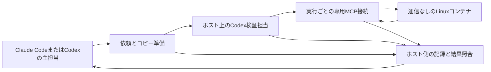

# Claude CodeとCodexから利用するLinux・Python隔離検証

- 状態: 2026-09-09、Linux試作の詳細仕様を確定。フルレビュー1回・差分再確認1回・機械検証1回を実施し、ユーザーが選択した機械検証で追加修正なく締めた。記録は`docs/records/reviews/2026-09-09-linux-pilot-spec-final.md`。
- 実装済み: Windowsホスト上のファイル・Git履歴コピー、プロセス管理、v1結果照合。履歴変更のレビューは`docs/records/reviews/2026-09-09-history-copy.md`。
- 未実装・未実証: 専用MCP接続、コンテナ管理、v2結果照合、ホスト操作の全経路制限、両主担当からの往復。通常利用は未対応。

## この文書の読み方

| ファイル | 責務 |
|---|---|
| `01-request-and-copy.md` | 依頼検査、ファイル・履歴の独立コピー、再検証入力 |
| `02-isolated-execution.md` | ホスト上のCodexの制限、専用接続、Docker内の実行と停止 |
| `03-result-collection.md` | 応答・実行証拠・原本状態の照合、再現テストの受け渡し |

## 目的と範囲

主担当はClaude CodeまたはCodexを維持する。検証担当のCodexはホスト上で動き、専用のSTDIO MCP接続を通じ、Linuxコンテナ内だけで資料検索・Git履歴参照・編集・テストを行う。MCPはAIが操作を呼ぶための接続方式であり、本試作では検証ごとに起動・終了する。ユーザー設定へ恒久登録しない。

親AIが資料本文を生成して渡す方式にしない。スクリプトがリポジトリのファイルと履歴を複製し、子は作業中に必要な情報を探索する。子が読んだ内容の入力トークンは必要になる。初回の題材は、小さなLinux・Pythonの不具合とその修正に限定する。

## 全体構成

| ブロック | インターフェース | 利用者 |
|---|---|---|
| 依頼・コピー準備 | `New-VerificationRun(RequestV2, SettingsV2) -> PreparedRunV2` | 実行・回収 |
| 制限付き実行 | `Start-VerificationExecution(PreparedRunV2) -> ExecutionResultV2` | 回収 |
| 結果回収 | `Complete-VerificationRun(PreparedRunV2, ExecutionResultV2) -> VerificationResultV2` | 呼び出した主担当 |

共通CLIは`Invoke-IsolatedVerification.ps1 -RequestPath ... -SettingsPath ...`。呼び出し先の既存仕様と同じ場所に置く。Linux試作はschemaVersion=2で識別し、先行v1部品のテスト成功をv2対応済みと読み替えない。

## 主な流れ

1. 依頼・設定・参照先を検査する。動作確認済みの実行構成が無ければblockedで返す。
2. 新しいrunIdでファイルとGit履歴を独立コピーへ準備する。再検証なら、前回の検査結果と採用する再現テストを照合して追加する。
3. 信頼する起動側が実行専用コンテナを作成し、IDと実効設定を保存する。通常シェル等を制限したCodexへ、そのコンテナ専用のMCP接続を渡す。
4. 子がコンテナ内で検索・編集・テストを行う。起動側が各操作と出力を記録する。
5. 終了・時間超過・異常時に当該コンテナと起動したプロセスだけを停止し、停止を確認して成果物を回収する。
6. 主担当が指摘・未確認事項・再現テストを受け取る。修正版の再検証は新しいrunIdで行い、日常の転記作業を利用者へ求めない。

## 保護と限界

書き込み可能なホスト側ファイルは、コンテナへ渡した当該実行の作業コピーだけとする。コンテナから原本・ホストホーム・認証情報・Dockerソケット・制御記録へ到達する経路を渡さない。コピーのGit管理領域は読み取り専用。コンテナ内の一時領域は実行ごとに分ける。

ホスト上の子AIには、専用接続を迂回するシェル・コード実行・ファイル操作・外部ツール・再委譲を許可しない。設定値の受理だけでは保証にならず、実際の操作経路を確認できなければ起動を止める。ホスト上の主担当と接続処理は信頼する側であり、この構成はそれら自身の誤操作を防ぐ境界ではない。

コンテナの通信制限と、ホスト上のモデル通信・認証を区別する。AIの判断の正しさ、テストの十分性、コンテナ基盤自体の脆弱性が無いことまでは保証しない。書き込み用ホストコピーに容量の強制上限はまだ無く、試作は小さな題材・時間制限で行う。この点を実行承認時の条件に含め、ディスク枯渇への完全な防護を主張しない。

## 完了基準

| 番号 | 必要な結果 |
|---|---|
| V1 | 不正依頼・範囲外パス・再解析ポイント・既存実行への上書き・不正な再検証入力を子の起動前に拒否 |
| V2 | 現在のファイル・Git履歴・HEADの状態を独立コピーへ保持し、準備中の更新を検出。子が必要資料を途中で探索できる |
| V3 | 追加テストで既知の欠陥を検出し、修正版の新実行で同じ再現テストが成功する。起動失敗を欠陥検出に数えない |
| V4 | 許可先の書き込み成功と、原本・Git・制御領域の代用品への変更拒否、ホスト機密代用品への読取拒否、ホストサービス・外部への通信拒否を対照付きで確認 |
| V5 | 起動失敗・不正応答・時間超過・原本更新を区別。当該コンテナと子プロセスが停止し、別実行が継続する |
| V6 | Claude CodeとCodexの実セッションから各1件以上を依頼し、検査・回収・修正後再検証まで人の本文転記なしに往復 |
| V7 | 原本と既存記録を保全し、配布整合を維持。新しい受け渡し経路で、架空の検査結果や別実行の証拠を合格にしない |

## 導入・承認・判断の分担

Windowsホスト、PowerShell 7、Git、Codex、Linux用Dockerが前提。Dockerサービスと既存イメージの存在は確認済みだが、試作に必要なGit・Python・テスト実行体とマウントの実効性は実行前に確認する。不足があれば専用イメージの準備案を提示し、既存LoopForAlphaを上書きしない。

判断の分担の承認基準はADR-0152が特定する構成案と本会話の承認。詳細仕様までの補助関数・データ項目・検査ケースはAIが具体化する。主要構成・新しい必須依存・検証担当・保護条件・既存LoopForAlpha変更は相談する。確定前レビュー判断、実装計画、イメージ取得・ビルド、コンテナ起動・終了、実モデル起動・外部送信、通常導入・公開は別途具体化して判断する。

## スコープ外と関連決定

Windows固有のコードをLinuxで検証済みと扱うこと、クラウド実行、汎用並列ジョブ管理、常設メッセージ基盤、原本への自動適用、実運用サービスを変更する検査、通常配布は含めない。既存Windows部品の撤去もしない。

ADR-0145（自律テスト）、0146（主担当2種・検証担当Codex）、0147（共通CLIと3責務）、0148・0150（独立Gitと履歴）、0149（AIなし部品の先行）、0151（Linux設計先行）、0152（専用接続とDocker実行）。現在の実装計画はv1先行部品の記録であり、本仕様確定後にv2用タスクへ更新する。
